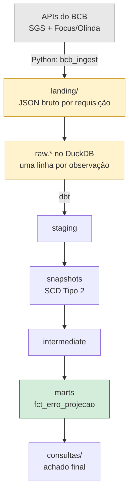

# Expectativa vs. Realizado — BCB (Python + dbt)

O Boletim Focus do Banco Central publica o que o mercado **projeta** para
IPCA, Selic, câmbio e PIB. O SGS publica o que **de fato aconteceu** com esses
mesmos indicadores. O produto final deste projeto é o cruzamento dos dois:
qual o erro histórico da projeção, e quanto ele diminui conforme a data de
referência se aproxima — respondido por um mart dbt alimentado por dados
ingeridos em Python direto das APIs do BCB.

Este é o quinto projeto de um portfólio que já cobre SQL Server, Azure,
Spark/Airflow e Kafka. O que ele precisa provar, e que os outros não provam:
Python como engenharia de verdade (pacote, tipagem, testes), consumo de API
como fonte de dados (paginação, contrato instável, estado incremental), e dbt
com snapshots (SCD Tipo 2) capturando revisão histórica de série temporal.

## Status do projeto

Estou construindo isto em cinco fases, validando cada uma de ponta a ponta
antes de passar para a próxima. Por enquanto:

- [x] **Fase 1 — Pacote e cliente HTTP**: cliente HTTP com retry, backoff e
  timeout explícito, contratos Pydantic do SGS e do Focus confirmados por
  chamada real às duas APIs, decodificadores dos dois formatos de erro,
  CLI de smoke test, 26 testes sem rede real
- [ ] **Fase 2 — Extração do SGS**: janelamento de até 10 anos, watermark por
  série, lookback para capturar revisão de dados já publicados
- [ ] **Fase 3 — Extração do Focus**: paginação `$top`/`$skip` com `$orderby`
  determinístico, carga incremental por data de coleta
- [ ] **Fase 4 — dbt**: staging, snapshot SCD2 sobre as revisões do SGS,
  marts de erro de projeção
- [ ] **Fase 5 — CI e apresentação**: GitHub Actions, CLI completa
  (`ingest`/`status`/`reset`), README final com o achado analítico

O achado final — o cruzamento entre projeção e realizado — e uma leitura
consolidada de trade-offs olhando o pipeline inteiro ficam para o fechamento,
depois de "Decisões e trade-offs", quando as cinco fases estiverem prontas.

## Arquitetura



Hoje só a chamada às APIs está implementada (caixas cinza). Landing, DuckDB
e dbt (caixas amarelas e verdes) ainda não existem.

## Versões fixadas

| Pacote | Faixa | Por quê |
|---|---|---|
| httpx | `>=0.28,<0.29` | cliente HTTP; API estável de `Client`/`Limits`/`Timeout` |
| pydantic | `>=2.13,<3` | v2, `extra="forbid"` e `field_validator` |
| structlog | `>=26.1,<27` | logging JSON com `contextvars` para bind de contexto entre camadas |
| pyarrow | `>=25,<26` | reservado para landing em Parquet — ainda não usado |
| duckdb | `>=1.5,<2` | reservado para `raw.*`/dbt — ainda não usado |
| pytest / respx / ruff / mypy | ver `pyproject.toml` | dev only |

Sem `pandas` — a ingestão usa `httpx` + `pydantic` + `pyarrow` + `duckdb`.

## Decisões e trade-offs

**Cliente síncrono (`httpx.Client`), não `asyncio`.** Isto é um pipeline de
ingestão em lote — um processo que roda, busca, grava e termina — não um
servidor com muitas conexões concorrentes de entrada. Testa mais simples com
`respx`, sem event loop. Paralelizar janelas de data no futuro resolve com
`concurrent.futures.ThreadPoolExecutor` sobre o mesmo cliente (`httpx.Client`
é thread-safe) em vez de reescrever tudo em `asyncio`.

**`client.py` nunca decodifica corpo de resposta, nem sucesso nem erro.**
Decide só por status code e exceção de transporte. É essa decisão que resolve
os dois formatos de erro completamente diferentes do BCB (ver "Peculiaridades
das APIs" abaixo) sem acoplar o cliente genérico a nenhum dos dois — quem
decodifica `{"error": ...}` (SGS) ou `/* {"codigo": ...} */` (Olinda) é o
módulo específico (`sgs.py`/`focus.py`), a partir do texto bruto carregado na
exceção `ErroRequisicaoInvalida`.

**Retry só em 429, 5xx e timeout — nunca em outro 4xx.** Um 4xx diferente de
429 é erro do chamador (URL errada, parâmetro inválido) e estoura na hora,
sem retentativa. Isso inclui o 406 de janela grande do SGS: repetir a mesma
requisição não muda nada, o problema é o parâmetro enviado.

**Backoff exponencial com jitter e respeito a `Retry-After`.** A espera entre
tentativas é `min(teto, base * 2^(tentativa-1))` mais um jitter aleatório de
até metade desse valor, para evitar que várias execuções simultâneas
sincronizem suas retentativas. Quando a resposta traz o header `Retry-After`
com um valor numérico, ele tem prioridade sobre o cálculo; um `Retry-After`
em formato de data (não numérico) é ignorado e cai de volta no cálculo
padrão.

**Requisição condicional para o SGS.** A API confirma suporte a `ETag`
(header presente na resposta) mas não a `Last-Modified`. `client.py` aceita
um `etag_anterior` opcional, envia `If-None-Match` e trata 304 como retorno
normal — sem erro, sem retry. O Focus/Olinda não devolve nenhum header de
cache condicional, então sua estratégia de incremental precisa ser watermark
próprio, não cache HTTP.

**`Decimal` para o valor do SGS, `float` para os agregados do Focus.** O SGS
manda `valor` como string (`"5.1816"`) — convertida direto para
`Decimal(string)` preserva exatamente a representação de origem, sem erro de
arredondamento binário, relevante para taxa/índice que alimenta contas
financeiras a jusante. O Focus manda `Media`/`Mediana` como número JSON nativo
— o serviço já perdeu qualquer precisão além de double IEEE-754 ao
serializar; promover a `Decimal` seria precisão falsa, e são agregados
estatísticos de pesquisa (média entre ~30-90 respondentes por observação).

**`extra="forbid"` em todos os contratos.** O objetivo é falhar alto e com
mensagem clara quando um campo mudar, nunca propagar dado malformado adiante.
Como cada recurso Focus tem seu próprio modelo Pydantic (não um contrato
genérico compartilhado no nível do item), isso é seguro por construção — os
esquemas realmente divergem entre `ExpectativasMercadoAnuais`,
`ExpectativasMercadoSelic` e `ExpectativaMercadoMensais`. Anual e Mensal usam
`DataReferencia` (formato `"aaaa"` e `"MM/aaaa"`, respectivamente); Selic não
tem `DataReferencia` — usa `Reuniao` (ex. `"R5/2028"`), porque a expectativa
de Selic é por reunião do Copom, não por data calendário.

**Nomenclatura dos campos Focus mantém o casing original da API**
(`Indicador`, `Media`, mas `numeroRespondentes`, `baseCalculo` minúsculos) em
vez de normalizar tudo para `snake_case` com `Field(alias=...)` em cada campo
— menos boilerplate, menos risco de erro de digitação no alias. Suprimido via
`ruff` (regra `N815`) só no arquivo de contratos.

**Datas em formatos diferentes por API.** SGS usa `dd/MM/aaaa` (exige parser
customizado); Focus usa ISO `aaaa-MM-dd` (Pydantic parseia nativo). É uma
inconsistência real entre as duas APIs do próprio BCB.

**Logging separado por responsabilidade.** `client.py` loga eventos de
transporte (tentativa, status, duração) via `structlog`; quem chama
(`sgs.py`) faz o bind do contexto de domínio (código da série, operação)
antes de invocar — as duas camadas se combinam na mesma linha de log sem
acoplamento. A configuração de logging só é aplicada pela CLI, nunca como
efeito colateral de importar o pacote. `httpx` também loga via `logging`
padrão do Python (`HTTP Request: GET ... "HTTP/1.1 200 OK"`); por isso todo
log — `structlog` e stdlib — vai para `stderr`, deixando `stdout` livre só
para a saída de dados da CLI (uma linha JSON por observação).

**CLI com `argparse`, não uma dependência externa.** Um único subcomando não
justifica o peso extra de `click`/`typer`.

## Peculiaridades das APIs do BCB

- **O erro de janela grande do SGS é HTTP 406, não 400/422**, e o corpo é um
  objeto JSON (`{"error", "message", "syntax"}`), não uma lista como a
  resposta de sucesso. O limite de janela é `<=` 10 anos: uma janela de
  exatamente 10 anos passa (200), 10 anos e 1 dia já quebra (406).
- **O corpo de erro do Olinda não é JSON puro** — vem envelopado em
  comentário JS: `/*{"codigo": 400, "mensagem": "..."}*/`. Um
  `response.json()` direto falha nesse formato.
- **Nem todo campo do Focus aparece com `$select` restrito.** O recurso
  `ExpectativasMercadoAnuais` tem os campos `IndicadorDetalhe` (nullable) e
  `DesvioPadrao`, que só aparecem numa consulta sem `$select` — um contrato
  derivado de uma amostra reduzida fica incompleto e quebra com
  `extra="forbid"` na primeira resposta completa.
- **Sintaxe OData v2/v3 não funciona no Olinda** — `substringof(...)`
  devolve 400; a sintaxe correta é `contains(campo, 'valor')` (OData v4).
- O indicador de PIB no Focus é `"PIB Total"`, não `"PIB"` sozinho — existem
  variantes como `"PIB Agropecuária"`.

## Números

26 testes automatizados, execução completa em cerca de 2,7s, sem chamada de
rede. Cobertura de `bcb_ingest`: 79% no total — `client.py` 96%,
`contratos.py` 97%, `focus.py` 100%, `sgs.py` 86%; `cli.py` e
`logging_config.py` ficam em 0% porque são validados pelo smoke test manual
(`make validar`), não por teste de unidade.

O smoke test da CLI (`ultimos --serie 1 --n 5`) contra a API real do SGS
roda em cerca de 0,9s e devolve o mesmo resultado em execuções consecutivas —
nada é persistido ainda nesta etapa, então não há efeito colateral a
verificar.

## Como rodar

```bash
# instalar o uv, se ainda não tiver
python -m pip install uv

# sincronizar o ambiente (cria .venv e instala deps + dev)
make setup            # equivalente: uv sync --extra dev

# testes, sem rede real
make test              # equivalente: uv run pytest -v

# lint e formatação
make lint               # equivalente: uv run ruff check . && uv run ruff format --check .

# tipagem estrita
make typecheck    # equivalente: uv run mypy bcb_ingest

# smoke test contra a API real do SGS — imprime 5 observações tipadas
uv run python -m bcb_ingest.cli ultimos --serie 1 --n 5
```

Em ambientes sem GNU Make, use os comandos `uv run ...` equivalentes listados
acima.
