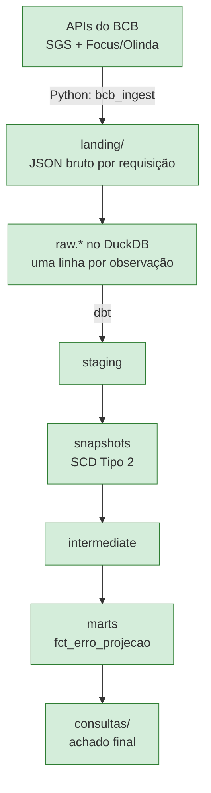

# Expectativa vs. Realizado — BCB (Python + dbt)

O Boletim Focus do Banco Central publica o que o mercado **projeta** para
IPCA, Selic, câmbio e PIB. O SGS publica o que **de fato aconteceu** com esses
mesmos indicadores. O produto final deste projeto é o cruzamento dos dois:
qual o erro histórico da projeção, e quanto ele diminui conforme a data de
referência se aproxima — respondido por um mart dbt alimentado por dados
ingeridos em Python direto das APIs do BCB.

Este é o quinto projeto de um portfólio que já cobre SQL Server, Azure,
Spark/Airflow e Kafka. O que ele precisa provar, e que os outros não provam:
Python como engenharia de verdade (pacote, tipagem, testes), consumo de API
como fonte de dados (paginação, contrato instável, estado incremental), e dbt
com snapshots (SCD Tipo 2) capturando revisão histórica de série temporal.

## Status do projeto

Estou construindo isto em cinco fases, validando cada uma de ponta a ponta
antes de passar para a próxima. Por enquanto:

- [x] **Fase 1 — Pacote e cliente HTTP**: cliente HTTP com retry, backoff e
  timeout explícito, contratos Pydantic do SGS e do Focus confirmados por
  chamada real às duas APIs, decodificadores dos dois formatos de erro,
  CLI de smoke test, 26 testes sem rede real
- [x] **Fase 2 — Extração do SGS**: janelamento de até 10 anos, watermark por
  série em `_controle.ingestao`, lookback de 90 dias para capturar revisão de
  dados já publicados, landing em JSON e upsert idempotente em
  `raw.sgs_observacao`, 21 testes novos
- [x] **Fase 3 — Extração do Focus**: paginação `$top`/`$skip` com `$orderby`
  determinístico sobre `ExpectativasMercadoAnuais`, carga incremental por
  data de coleta, upsert idempotente em `raw.focus_expectativa`, 14 testes
  novos
- [x] **Fase 4 — dbt**: staging, snapshot SCD2 sobre as revisões do SGS,
  seeds de mapeamento indicador↔série, normalização de unidades, marts de
  erro de projeção, 69 testes dbt (genéricos + 3 singulares)
- [ ] **Fase 5 — CI e apresentação**: GitHub Actions, CLI completa
  (`ingest`/`status`/`reset`), README final consolidado

O achado já está abaixo, em "O que os dados mostram" — uma leitura
consolidada de trade-offs olhando o pipeline inteiro fica para o fechamento
da Fase 5.

## O que os dados mostram

`mart_convergencia_focus` responde à pergunta central do projeto: o erro
mediano do Focus cai conforme a data de referência se aproxima, para os
quatro indicadores, sem exceção:

| Indicador | ≤30 dias | 31-90 dias | 91-180 dias | 181-365 dias | 366+ dias |
|---|---|---|---|---|---|
| Selic (meta) | 0,00 | 0,00 | 0,50 | 1,50 | 3,25 |
| Câmbio | 0,05 | 0,09 | 0,13 | 0,34 | 0,67 |
| IPCA | 0,10 | 0,38 | 0,55 | 0,97 | 1,40 |
| PIB Total | 0,41 | 0,38 | 0,43 | 0,99 | 1,59 |

(erro absoluto mediano, mesma unidade do indicador - pontos percentuais para
os quatro). Selic é o caso mais nítido: erro praticamente zero a até 90 dias
da decisão do Copom (o mercado já sabe o que vem por aí) contra 3,25 pontos
de erro mediano para projeções feitas mais de um ano antes. PIB Total é o
único com uma pequena inversão entre as duas primeiras faixas (0,41 → 0,38) -
com poucas centenas de observações por faixa, dá para ser ruído amostral, não
uma quebra do padrão geral.

## Arquitetura



O pipeline completo já roda de ponta a ponta, das duas APIs até os marts.
Falta CI e a apresentação final (Fase 5).

## Versões fixadas

| Pacote | Faixa | Por quê |
|---|---|---|
| httpx | `>=0.28,<0.29` | cliente HTTP; API estável de `Client`/`Limits`/`Timeout` |
| pydantic | `>=2.13,<3` | v2, `extra="forbid"` e `field_validator` |
| structlog | `>=26.1,<27` | logging JSON com `contextvars` para bind de contexto entre camadas |
| pyarrow | `>=25,<26` | monta as tabelas em memória para o bulk insert no DuckDB (ver "Decisões") |
| duckdb | `>=1.5,<2` | `raw.sgs_observacao`, `raw.focus_expectativa`, `_controle.*` |
| dbt-core | `>=1.12,<2` | staging, snapshot, intermediate e marts |
| dbt-duckdb | `>=1.11,<2` | adapter dbt para o mesmo arquivo DuckDB da ingestão |
| pytest / respx / ruff / mypy / pyarrow-stubs | ver `pyproject.toml` | dev only |

Sem `pandas` — a ingestão usa `httpx` + `pydantic` + `pyarrow` + `duckdb`.

## Decisões e trade-offs

**Cliente síncrono (`httpx.Client`), não `asyncio`.** Isto é um pipeline de
ingestão em lote — um processo que roda, busca, grava e termina — não um
servidor com muitas conexões concorrentes de entrada. Testa mais simples com
`respx`, sem event loop. Paralelizar janelas de data no futuro resolve com
`concurrent.futures.ThreadPoolExecutor` sobre o mesmo cliente (`httpx.Client`
é thread-safe) em vez de reescrever tudo em `asyncio`.

**`client.py` nunca decodifica corpo de resposta, nem sucesso nem erro.**
Decide só por status code e exceção de transporte. É essa decisão que resolve
os dois formatos de erro completamente diferentes do BCB (ver "Peculiaridades
das APIs" abaixo) sem acoplar o cliente genérico a nenhum dos dois — quem
decodifica `{"error": ...}` (SGS) ou `/* {"codigo": ...} */` (Olinda) é o
módulo específico (`sgs.py`/`focus.py`), a partir do texto bruto carregado na
exceção `ErroRequisicaoInvalida`.

**Retry só em 429, 5xx e timeout — nunca em outro 4xx.** Um 4xx diferente de
429 é erro do chamador (URL errada, parâmetro inválido) e estoura na hora,
sem retentativa. Isso inclui o 406 de janela grande do SGS: repetir a mesma
requisição não muda nada, o problema é o parâmetro enviado.

**Backoff exponencial com jitter e respeito a `Retry-After`.** A espera entre
tentativas é `min(teto, base * 2^(tentativa-1))` mais um jitter aleatório de
até metade desse valor, para evitar que várias execuções simultâneas
sincronizem suas retentativas. Quando a resposta traz o header `Retry-After`
com um valor numérico, ele tem prioridade sobre o cálculo; um `Retry-After`
em formato de data (não numérico) é ignorado e cai de volta no cálculo
padrão.

**Requisição condicional para o SGS.** A API confirma suporte a `ETag`
(header presente na resposta) mas não a `Last-Modified`. `client.py` aceita
um `etag_anterior` opcional, envia `If-None-Match` e trata 304 como retorno
normal — sem erro, sem retry. O Focus/Olinda não devolve nenhum header de
cache condicional, então sua estratégia de incremental precisa ser watermark
próprio, não cache HTTP.

**`Decimal` para o valor do SGS, `float` para os agregados do Focus.** O SGS
manda `valor` como string (`"5.1816"`) — convertida direto para
`Decimal(string)` preserva exatamente a representação de origem, sem erro de
arredondamento binário, relevante para taxa/índice que alimenta contas
financeiras a jusante. O Focus manda `Media`/`Mediana` como número JSON nativo
— o serviço já perdeu qualquer precisão além de double IEEE-754 ao
serializar; promover a `Decimal` seria precisão falsa, e são agregados
estatísticos de pesquisa (média entre ~30-90 respondentes por observação).

**`extra="forbid"` em todos os contratos.** O objetivo é falhar alto e com
mensagem clara quando um campo mudar, nunca propagar dado malformado adiante.
Como cada recurso Focus tem seu próprio modelo Pydantic (não um contrato
genérico compartilhado no nível do item), isso é seguro por construção — os
esquemas realmente divergem entre `ExpectativasMercadoAnuais`,
`ExpectativasMercadoSelic` e `ExpectativaMercadoMensais`. Anual e Mensal usam
`DataReferencia` (formato `"aaaa"` e `"MM/aaaa"`, respectivamente); Selic não
tem `DataReferencia` — usa `Reuniao` (ex. `"R5/2028"`), porque a expectativa
de Selic é por reunião do Copom, não por data calendário.

**Nomenclatura dos campos Focus mantém o casing original da API**
(`Indicador`, `Media`, mas `numeroRespondentes`, `baseCalculo` minúsculos) em
vez de normalizar tudo para `snake_case` com `Field(alias=...)` em cada campo
— menos boilerplate, menos risco de erro de digitação no alias. Suprimido via
`ruff` (regra `N815`) só no arquivo de contratos. Pela mesma razão de
convenção — código, nomes e mensagens em português —, as exceções do projeto
usam prefixo `Erro` em vez do sufixo `Error` esperado pelo inglês
(`ErroSgs`, `ErroFocus`, `ErroClienteBcb`); a regra correspondente (`N818`)
é ignorada no projeto inteiro.

**Datas em formatos diferentes por API.** SGS usa `dd/MM/aaaa` (exige parser
customizado); Focus usa ISO `aaaa-MM-dd` (Pydantic parseia nativo). É uma
inconsistência real entre as duas APIs do próprio BCB.

**Logging separado por responsabilidade.** `client.py` loga eventos de
transporte (tentativa, status, duração) via `structlog`; quem chama
(`sgs.py`) faz o bind do contexto de domínio (código da série, operação)
antes de invocar — as duas camadas se combinam na mesma linha de log sem
acoplamento. A configuração de logging só é aplicada pela CLI, nunca como
efeito colateral de importar o pacote. `httpx` também loga via `logging`
padrão do Python (`HTTP Request: GET ... "HTTP/1.1 200 OK"`); por isso todo
log — `structlog` e stdlib — vai para `stderr`, deixando `stdout` livre só
para a saída de dados da CLI (uma linha JSON por observação).

**CLI com `argparse`, não uma dependência externa.** Um único subcomando não
justifica o peso extra de `click`/`typer`.

**Janelamento de até 10 anos.** `particionar_janelas` divide qualquer
intervalo em pedaços de no máximo 10 anos, replicando exatamente o limite
confirmado do SGS (mesma data um ano múltiplo de 10 à frente ainda passa; um
dia a mais já quebra). Reaproveita o mesmo cálculo tanto na primeira carga
histórica quanto no lookback incremental, para não ter dois caminhos de código
fazendo a mesma coisa.

**Lookback de 90 dias em vez de só pegar o que é novo.** Toda carga
incremental reprocessa os últimos 90 dias, não só a partir da última
observação. Séries do SGS são revisadas depois de publicadas — um valor de
uma data passada muda — e é esse reprocessamento que dá ao snapshot dbt da
Fase 4 alguma coisa para capturar como SCD Tipo 2.

**Idempotência via upsert, não log append-only.** `raw.sgs_observacao` tem
chave primária `(codigo_serie, data_referencia)` e a carga faz
`INSERT ... ON CONFLICT DO UPDATE`. Rodar a mesma janela duas vezes não
duplica linha; se o valor mudou (revisão), a linha existente é atualizada em
vez de uma nova ser criada. Isso empurra a responsabilidade de guardar
histórico de revisão para o snapshot dbt (que compara execuções sucessivas),
em vez de `raw` virar um log crescente que a Fase 4 precisaria deduplicar.

**Hash por observação, não por janela.** `_hash_payload` é o SHA-256 do item
bruto individual (`{"data": ..., "valor": ...}`), não da resposta inteira da
janela — cada linha carrega a prova de exatamente qual JSON de origem gerou
aquele valor, o que importa mais que ter um hash único por arquivo de landing
(esse já existe como artefato auditável por si só).

**Timeout de leitura de 30s, não 15s.** O valor original da Fase 1 olhava só
para o endpoint `/ultimos/{n}` (payload minúsculo) e ficou apertado demais
para janelas históricas de 10 anos, que rotineiramente passam de 15s de
resposta — o retry cobre isso sem falha visível, mas quase dobra o tempo
total da carga. Com 30s de timeout, as mesmas janelas respondem de forma
consistente sem nenhuma retentativa (números em "Números" abaixo).

**Query string sempre montada com `%20`, nunca `+`.** `client.py` monta a
query manualmente com `urlencode(params, quote_via=quote)` em vez de deixar
o `httpx` codificar via `params=`. O `httpx` por padrão usa `+` para espaço
(convenção `application/x-www-form-urlencoded`), e o serviço Olinda não
decodifica `+` como espaço — um `$filter` com `and`/`eq` normal quebra com
erro de tipo (`Edm.Boolean`/`Edm.String` incompatíveis) só por causa do `+`.
Corrigido no cliente genérico, não só no Focus, porque é uma armadilha que
afetaria qualquer parâmetro futuro com espaço, em qualquer chamador.

**Bulk insert via pyarrow, não `executemany`.** A primeira versão do upsert
usava `con.executemany(...)` linha a linha; para uma página de 1000
observações do Focus isso levava ~17s — mesmo com a conexão em memória, sem
nenhuma rede envolvida. Um único `INSERT` com 1000 tuplas de `VALUES` inline
melhora para ~8,7s, ainda inaceitável. Registrando os dados como uma tabela
pyarrow (`con.register(...)`) e fazendo `INSERT ... SELECT ... FROM
tabela_registrada ON CONFLICT DO UPDATE`, a mesma página cai para ~0,06s —
quase 300x mais rápido. DuckDB é um banco colunar; um `INSERT` linha a linha
ou uma `VALUES` gigante inline não usa o caminho vetorizado de carga, que só
é acionado ao inserir a partir de um objeto colunar já registrado. Essa
mesma função é usada tanto pelo SGS quanto pelo Focus.

**`ExpectativasMercadoAnuais` é o único recurso do Focus implementado.** Os
quatro indicadores exigidos (IPCA, Selic, Câmbio, PIB) têm entrada nesse
recurso — inclusive "Selic", que é uma expectativa anual distinta da
expectativa por reunião do Copom (`ExpectativasMercadoSelic`, ainda não
implementado). `ExpectativaMercadoMensais` e as variantes `Top5` também
ficam fora do escopo por ora.

**Chave natural inclui `baseCalculo`.** Uma mesma combinação de indicador,
data de coleta e data de referência aparece duas vezes no Focus — uma linha
por metodologia de cálculo (`baseCalculo` 0 e 1). Sem essa coluna na chave
primária de `raw.focus_expectativa`, a segunda linha sobrescreveria a
primeira no upsert, perdendo metade do dado. `IndicadorDetalhe` também entra
na chave (coalescido para string vazia, já que é nulo para os quatro
indicadores usados e `PRIMARY KEY` não aceita `NULL`).

**Paginação sempre continua até uma página vazia, mesmo após uma parcial.**
Uma página com menos itens que `$top` não é tratada como sinal de fim — só
uma página com zero itens encerra o laço. É mais uma requisição no pior
caso, mas remove qualquer suposição sobre o servidor sempre preencher a
página até o limite antes da última.

**Códigos SGS do `de_para_indicador` confirmados por chamada real, um por
um, sem chutar nenhum.** IPCA é a série 433 (variação mensal — confirmado
pelos valores retornados, plausíveis para inflação mensal, e por fonte
externa). PIB Total é a série 7326 ("PIB - taxa de variação real no ano",
anual — confirmado por duas fontes externas independentes). Selic é a série
432, **não a 11**: a 11 é a taxa Selic efetiva diária, mas o que o Focus
projeta é a meta Selic definida pelo Copom (série 432, valor constante entre
reuniões) — confirmado tanto pelo comportamento dos dados (432 fica igual
por dias seguidos, 11 varia diariamente) quanto por fonte externa. Câmbio
reaproveita a série 1 (dólar venda), já confirmada na Fase 1.

**`baseCalculo = 0` escolhido para o grão dos marts, sem confirmação oficial
do que ele significa.** O Focus devolve duas linhas por indicador/data/ano de
referência, uma por `baseCalculo`. Não há documentação oficial do BCB (FAQ do
Sistema Expectativas de Mercado, metadata OData, Swagger) que defina o que
distingue 0 de 1 — só evidência indireta de que a base 0 consistentemente tem
mais respondentes que a 1 nas amostras conferidas (ex. 148 vs. 95). A base 0
foi escolhida por ter a amostra mais ampla: uma decisão por evidência
observada, não por definição oficial confirmada.

**Normalização de unidades no `int_sgs_realizado_anual`.** O Focus projeta
sempre um valor anual, mas cada série SGS realizada chega numa granularidade
diferente: IPCA (433) é variação **mensal**, acumulada via juros compostos
até fechar o ano; Câmbio (1) e Meta Selic (432) são **diárias**, das quais se
usa a última observação do ano (valor de fim de período, do jeito que o
Focus também projeta); PIB Total (7326) já é anual, sem transformação. Um
flag `ano_completo` marca anos sem os 12 meses (IPCA) ou sem observação em
dezembro (Câmbio/Selic) — `fct_erro_projecao` só usa anos completos.

**Chave natural computada em vez de `dbt_utils` para testes de unicidade
composta.** Concatenar as colunas da chave num único campo `chave_natural`
(em `stg_*` e nos marts) permite usar o teste genérico `unique` do dbt-core
puro. Evita adicionar uma dependência de pacote externo (`dbt deps`) só para
um teste de unicidade em múltiplas colunas.

**Snapshot com `unique_key` na `chave_natural`, estratégia `check` sobre
`valor`.** A cada rodada do snapshot, se o valor mudou para a mesma chave, a
versão antiga é fechada (`dbt_valid_to` preenchido) e uma nova é aberta — é
essa mecânica que transforma a revisão de uma série do SGS em SCD Tipo 2 (ver
"Snapshot" abaixo para um caso real).

**`profiles.yml` do dbt lê o mesmo `BCB_DUCKDB_PATH` do `bcb_ingest`.** dbt e
a ingestão em Python apontam para o mesmo arquivo DuckDB por padrão — não há
um passo de "exportar" dados de um lado para o outro, `dbt build` lê
diretamente o que `bcb_ingest` gravou.

## Snapshot (SCD Tipo 2)

Nenhuma revisão real do BCB ocorreu no período de construção deste projeto
— uma nova consulta à API horas depois de uma carga não mostrou mudança em
nenhum valor recém-carregado (revisão de série publicada não é um evento
diário). Para demonstrar que o mecanismo funciona mesmo assim, uma revisão
foi simulada pelo próprio caminho de código de upsert
(`armazenamento.upsert_observacoes`), sobrescrevendo o dólar venda de
03/06/2024 de 5,2373 para 5,2400 sob um `_execucao_id` rotulado
`SIMULACAO_REVISAO_DEMO_SCD2` — deixando claro que essa linha específica não
veio do BCB. O snapshot antes e depois dessa simulação:

| valor | dbt_valid_from | dbt_valid_to |
|---|---|---|
| 5,2373 | 2026-09-07 14:43:40 | 2026-09-07 14:48:50 |
| 5,2400 | 2026-09-07 14:48:50 | *(nulo — vigente)* |

A versão antiga fechou exatamente no instante em que a nova entrou, sem
sobreposição (garantido pelo teste singular
`assert_snapshot_sem_sobreposicao_vigencia`) — o mesmo mecanismo que vai
capturar uma revisão de verdade quando o BCB publicar uma.

## Peculiaridades das APIs do BCB

- **O erro de janela grande do SGS é HTTP 406, não 400/422**, e o corpo é um
  objeto JSON (`{"error", "message", "syntax"}`), não uma lista como a
  resposta de sucesso. O limite de janela é `<=` 10 anos: uma janela de
  exatamente 10 anos passa (200), 10 anos e 1 dia já quebra (406).
- **O corpo de erro do Olinda não é JSON puro** — vem envelopado em
  comentário JS: `/*{"codigo": 400, "mensagem": "..."}*/`. Um
  `response.json()` direto falha nesse formato.
- **Nem todo campo do Focus aparece com `$select` restrito.** O recurso
  `ExpectativasMercadoAnuais` tem os campos `IndicadorDetalhe` (nullable) e
  `DesvioPadrao`, que só aparecem numa consulta sem `$select` — um contrato
  derivado de uma amostra reduzida fica incompleto e quebra com
  `extra="forbid"` na primeira resposta completa.
- **Sintaxe OData v2/v3 não funciona no Olinda** — `substringof(...)`
  devolve 400; a sintaxe correta é `contains(campo, 'valor')` (OData v4).
- O indicador de PIB no Focus é `"PIB Total"`, não `"PIB"` sozinho — existem
  variantes como `"PIB Agropecuária"`.
- **Uma janela de 10 anos do SGS pode levar bem mais que alguns segundos.**
  O tempo de resposta varia de ~5s a ~21s dependendo da janela, mesmo para
  payloads pequenos (menos de 100KB) — a latência parece dominada pelo lado
  do servidor, não pelo tamanho da resposta, então não dá para presumi-la
  baixa só porque o payload é pequeno. O Focus, em contraste, responde em
  menos de 0,5s por página de 1000 linhas — a lentidão é específica do SGS,
  não das APIs do BCB em geral.
- **O Olinda não decodifica `+` como espaço na query string** (ver
  "Decisões" acima) — o efeito prático é um erro 400 que não menciona
  codificação em lugar nenhum, só reclama de tipos incompatíveis.
- **`Minimo`, `Maximo` e `numeroRespondentes` vêm `null` em dados antigos do
  Focus** (confirmado desde o ano 2000 em `ExpectativasMercadoAnuais`,
  `ExpectativasMercadoSelic` e `ExpectativaMercadoMensais`) — o levantamento
  inicial da Fase 1 só tinha visto dados recentes, sempre completos.
- **Duas linhas por indicador/data/data-referência**, distinguidas só por
  `baseCalculo` (0 ou 1) — sem essa coluna, parece dado duplicado.
- **`/$count` do Olinda devolve 403.** Não dá para saber o total de linhas
  de um indicador antes de paginar; a única forma de saber que a carga
  terminou é a página vazia.

## Persistência

**Landing**: `landing/sgs/serie={codigo}/janela={inicio}_{fim}.json`, com as
datas da janela em ISO (`aaaa-mm-dd`) — ordena como string e não tem
ambiguidade de formato, ao contrário do `dd/MM/aaaa` que a API usa na query.

**`raw.sgs_observacao`**: `codigo_serie`, `data_referencia` (DATE),
`valor` (DECIMAL(18,6) — mesma razão da Fase 1: nunca float para valor de
série), `_carregado_em`, `_execucao_id`, `_hash_payload`, com chave primária
`(codigo_serie, data_referencia)`.

**`_controle.ingestao`**: uma linha por série, com `data_ultima_observacao`,
o horizonte (`horizonte_inicio`/`horizonte_fim`) e a contagem de linhas da
última execução — é o que decide, na próxima carga, se busca desde `--desde`
(sem watermark ainda) ou desde `data_ultima_observacao - lookback_dias`.

**Landing do Focus**: `landing/focus/indicador={nome}/pagina={skip}_{top}.json`
— uma página por arquivo, nomeada pelos dois parâmetros que a definem.

**`raw.focus_expectativa`**: `indicador`, `indicador_detalhe`,
`data_referencia` (VARCHAR — formato varia por periodicidade, normalização
fica pra Fase 4), `data_coleta` (DATE), `base_calculo`, `media`/`mediana`/
`desvio_padrao` (DOUBLE — mesma razão da Fase 1: já chegam como número JSON,
não string), `minimo`/`maximo`/`numero_respondentes` (nulos em dados
antigos), `_carregado_em`, `_execucao_id`, `_hash_payload`, com chave
primária `(indicador, indicador_detalhe, data_referencia, data_coleta,
base_calculo)`.

**`_controle.ingestao_focus`**: uma linha por indicador, com
`data_coleta_maxima` e a contagem de linhas da última execução — sem
horizonte, porque a carga incremental do Focus não tem data final: sempre
busca "tudo que for mais novo que a última coleta conhecida".

**Camadas do dbt** (schemas separados no mesmo `bcb.duckdb`): `staging`
(`stg_sgs_observacao`, `stg_focus_expectativa` — views, deduplicadas por
chave natural), `snapshots` (`snp_sgs_observacao` — SCD Tipo 2),
`intermediate` (`int_focus_horizonte`, `int_sgs_realizado_anual` — views),
`marts` (`fct_serie_observada`, `fct_expectativa`, `fct_erro_projecao`,
`mart_convergencia_focus` — tables), `seeds` (`de_para_indicador`,
`dim_serie`).

## Números

61 testes automatizados, execução completa em cerca de 6,8s, sem chamada de
rede. Cobertura de `bcb_ingest`: 80% no total — `db.py`, `estado.py` e
`janelas.py` em 100%, `armazenamento.py` 95%, `client.py` 98%,
`contratos.py` 97%, `focus.py` 96%, `sgs.py` 91%; `cli.py` e
`logging_config.py` ficam em 0% porque são validados pelo smoke test manual
(`make validar`), não por teste de unidade.

O smoke test da CLI (`ultimos --serie 1 --n 5`) contra a API real do SGS
roda em cerca de 0,9s e devolve o mesmo resultado em execuções consecutivas.

**Carga histórica das três séries diárias do SGS**, `--desde 1995-01-01` até
hoje (2026-09-07), 4 janelas de 10 anos cada:

| Série | Linhas carregadas | Duração |
|---|---|---|
| 1 (dólar venda) | 7.952 | 60,1s |
| 11 (Selic) | 7.952 | 59,4s |
| 12 (CDI) | 7.952 | 59,6s |

Nenhuma das três teve retentativa — o tempo é inteiramente latência real do
SGS para janelas de 10 anos (~19-20s por janela, 4 janelas por série).

**Carga histórica dos quatro indicadores do Focus** (`ExpectativasMercadoAnuais`,
histórico completo, sem `--desde`):

| Indicador | Linhas carregadas | Páginas | Duração |
|---|---|---|---|
| IPCA | 48.352 | 49 | 15,6s |
| Selic | 39.252 | 40 | 12,3s |
| Câmbio | 39.075 | 40 | 12,4s |
| PIB Total | 39.400 | 40 | 13,1s |

Contagem por indicador e ano de referência (amostra 2026-2030, `IPCA`):
2026 → 2.328 coletas, 2027 → 1.826, 2028 → 1.326, 2029 → 822, 2030 → 320 —
decrescente porque anos de referência mais distantes entraram no horizonte
de 5 anos do Focus mais recentemente, então têm menos coletas acumuladas.

`bcb.duckdb`: 19MB. `landing/sgs/`: 1,1MB em 13 arquivos. `landing/focus/`:
37MB em 173 arquivos (169 páginas de dados + 4 páginas finais vazias).
`raw.sgs_observacao`: 23.856 linhas. `raw.focus_expectativa`: 166.079 linhas.

**Idempotência**: uma carga incremental imediata da série 1 do SGS (sem
`--desde`, watermark + lookback de 90 dias) busca 65 linhas do período
recente em 0,6s; a contagem total em `raw.sgs_observacao` para a série 1
permanece em 7.952 antes e depois. Uma carga incremental imediata do IPCA
no Focus não encontra nada mais novo que a última coleta (1 página vazia,
0,16s) e a contagem em `raw.focus_expectativa` permanece em 48.352 — em
ambos os casos porque o upsert atualiza linhas existentes em vez de
duplicá-las.

Além das três séries diárias, mais três séries do SGS foram carregadas para
ter realizado comparável aos quatro indicadores do Focus: Meta Selic (432,
9.747 linhas, 144,1s — duas janelas bateram no timeout mesmo em 30s antes de
uma terceira tentativa passar em 0,3s), IPCA (433, 319 linhas, 1,7s) e PIB
Total (7326, 26 linhas, 1,0s) — as duas últimas, mensal e anual, muito mais
rápidas que as diárias por terem uma ordem de magnitude menos linhas por
janela.

`dbt build` (2 seeds, 1 snapshot, 4 tabelas, 4 views, 58 testes genéricos +
3 singulares = 69 no total): completa em ~1,7s, 69/69 passam. Contagem final
por tabela: `raw.sgs_observacao` 33.948 linhas (6 séries), `raw.focus_expectativa`
166.079 linhas (4 indicadores), `fct_serie_observada` 33.948 linhas (mesmo
total do raw, sem revisão pendente fechando nenhuma versão),
`fct_expectativa` 129.775 linhas (só `baseCalculo=0`), `fct_erro_projecao`
116.422 linhas (só anos completos: exclui 2026 do IPCA, que só tem 7 dos 12
meses do ano carregados), `mart_convergencia_focus` 20 linhas (4 indicadores
× 5 faixas de horizonte).

## Como rodar

```bash
# instalar o uv, se ainda não tiver
python -m pip install uv

# sincronizar o ambiente (cria .venv e instala deps + dev)
make setup            # equivalente: uv sync --extra dev

# testes, sem rede real
make test              # equivalente: uv run pytest -v

# lint e formatação
make lint               # equivalente: uv run ruff check . && uv run ruff format --check .

# tipagem estrita
make typecheck    # equivalente: uv run mypy bcb_ingest

# smoke test contra a API real do SGS — imprime 5 observações tipadas
uv run python -m bcb_ingest.cli ultimos --serie 1 --n 5

# carga histórica de uma série (primeira vez, precisa de --desde)
uv run python -m bcb_ingest.cli carregar --serie 1 --desde 1995-01-01
# equivalente: make ingest SERIE=1 DESDE=1995-01-01

# carga incremental (já existe watermark, --desde é ignorado)
uv run python -m bcb_ingest.cli carregar --serie 1
# equivalente: make ingest SERIE=1

# carga histórica de um indicador do Focus (primeira e demais vezes: sempre
# incremental a partir da última coleta conhecida, sem argumento de data)
uv run python -m bcb_ingest.cli carregar-focus --indicador IPCA
# equivalente: make ingest-focus INDICADOR=IPCA

# transformação: seeds + snapshot + staging + intermediate + marts + testes
uv run dbt build --project-dir dbt --profiles-dir dbt
# equivalente: make dbt

# lineage e documentação navegável no navegador
uv run dbt docs generate --project-dir dbt --profiles-dir dbt
uv run dbt docs serve --project-dir dbt --profiles-dir dbt
# equivalente: make dbt-docs
```

Em ambientes sem GNU Make, use os comandos `uv run ...` equivalentes listados
acima.
